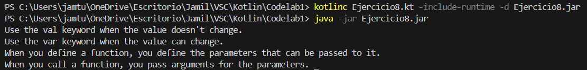
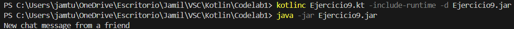
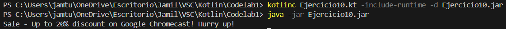
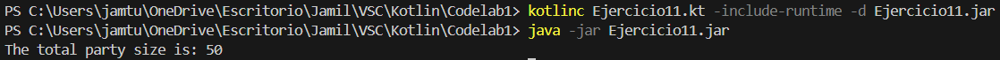
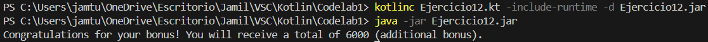
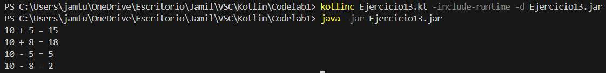
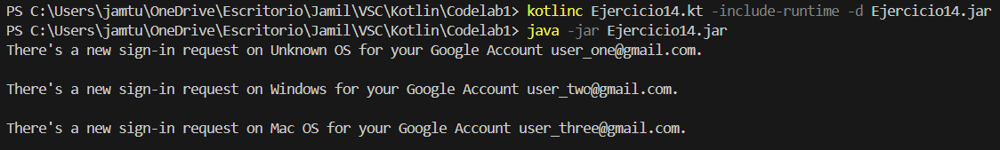
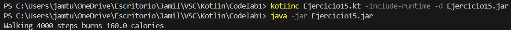
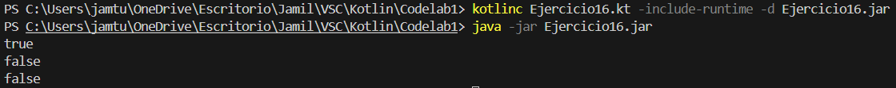
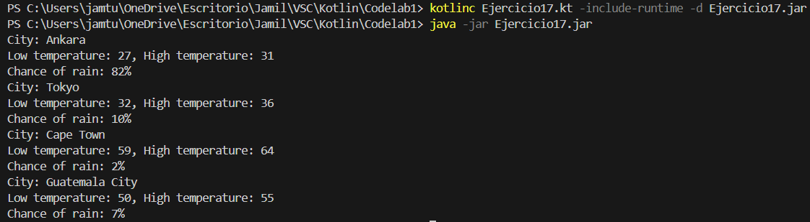

# CODELAB 2: INTRODUCCIÓN A LA PROGRAMACIÓN EN KOTLIN

## LISTA DE EJERCICIOS (Tu primer programa en kotlin):
- Ejercicio 1
  

- Ejercicio 2
  

- Ejercicio 3
  

- Ejercicio 4
  

- Ejercicio 5
  

- Ejercicio 6
  

- Ejercicio 7
  

- Ejercicio 8
  

- Ejercicio 9
  

- Ejercicio 10
   

- Ejercicio 11
   

- Ejercicio 12
   

- Ejercicio 13
   

- Ejercicio 14
   

- Ejercicio 15
   

- Ejercicio 16
   

- Ejercicio 17
   