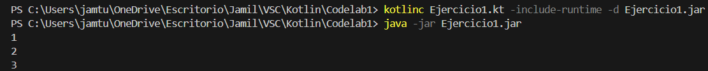
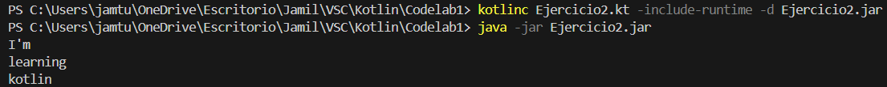
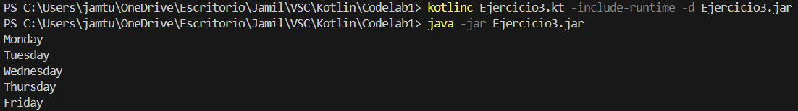
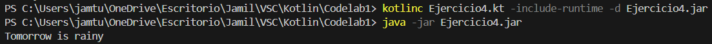
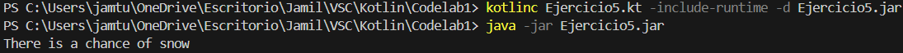
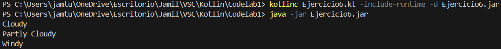
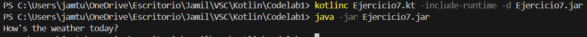

# CODELAB 2: INTRODUCCIÓN A LA PROGRAMACIÓN EN KOTLIN

## LISTA DE EJERCICIOS (Tu primer programa en kotlin):
- Ejercicio 1
  

- Ejercicio 2
  

- Ejercicio 3
  

- Ejercicio 4
  

- Ejercicio 5
  

- Ejercicio 6
  

- Ejercicio 7
   